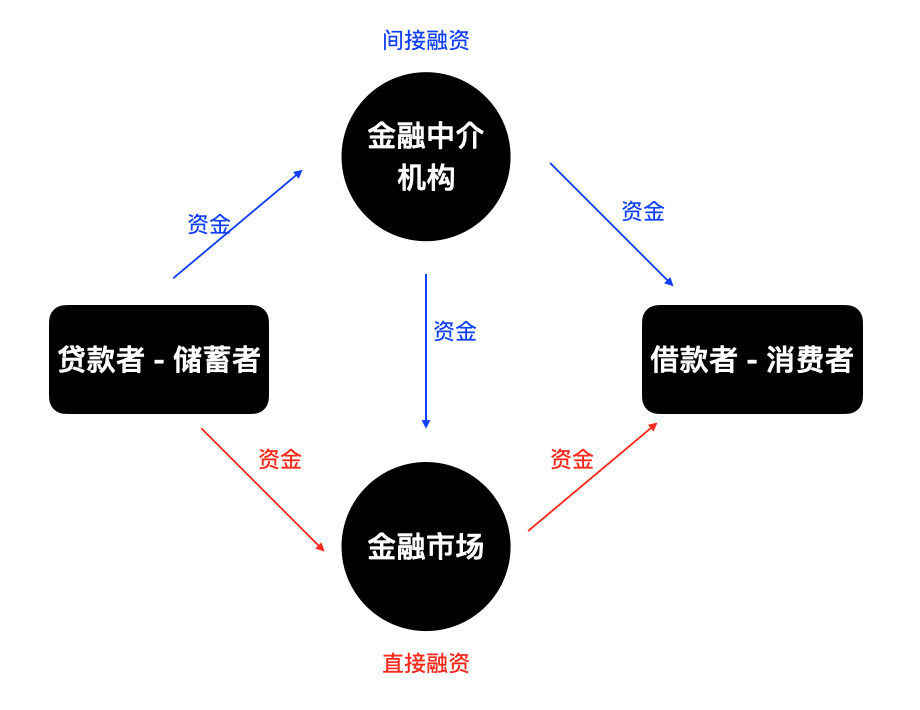

[TOC]

# 1. 金融市场的功能

在金融市场中，通过实现从没有生产用途者向有生产用途者的资金转移提高经济效率。通常是将储蓄者（贷款者）的资金转移到消费者（借款者）。

**储蓄者**（贷款者）：主要是居民，而工商企业、政府（特别是州和地方政府）、外国人和外国政府有时也会持有盈余资金，并且希望将资金贷放出去。

**消费者**（借款者）：主要是企业和政府（特别是联邦政府），而居民和外国人也会为了购买汽车、家具以及住宅来借款融资。

金融融资的两种方式：

- **直接融资**。借款者通过向金融市场里的贷款者出售证券（又称为金融工具），直接从后者手中获取资金，这些证券代表了对借款者未来收益或者资产的求偿权。对其购入者而言，证券是资产；而对其出售（发行）者而言，证券是负债[liabilities，借据（IOU）或者债务]。
- **间接融资**。间接融资是指通过金融中介机构来进行融资的方式，而不是直接与资金需求方进行交易。在间接融资中，金融中介机构充当了资金提供方和资金需求方之间的桥梁和中介角色。

　

# 2. 金融市场的结构

## 2.1 债务市场和股票市场

个人和公司从金融市场募集资金的方式：

- 发行诸如**债券**或者**抵押票据**等抵押债务工具。它是一种契约协议，由借款者向债券持有人定期支付固定的金额（本金和利息），直到一个特定日期（到期日）支付最后一笔金额为止。根据债务的期限将债务工具分为
  - **短期**：期限短于一年
  - **中期**：期限介于1～10年
  - **长期**：期限到达10以及10年以上
- 发行**普通股股票**等股权。股权工具是其持有者按份额拥有的对企业净收益（扣除费用和税收后的收入）和资产的求偿权。

与债务工具相比，公司股权的主要缺点是其持有人具有的是剩余求偿权（residual claimant），即公司必须在完成对所有债权人的偿付之后，才能对其股权持有者进行偿付。

## 2.2 一级市场和二级市场

- **一级市场**（primary market）是筹集资金的公司或者政府机构将新发行的债券或者股票等出售给最初购买者的金融市场。公众不太熟悉一级市场的原因在于，向最初购买者销售证券的过程通常不是公开进行的。在一级市场中有一种协助实施证券首次销售的重要金融机构，即投资银行（investment bank）。投资银行协助实施证券首次销售的方法是证券承销（underwriting）：它为公司证券提供了一个承诺的价格，继而将其向公众发售。

- **二级市场**（secondary market）是已经发行的证券进行转售交易的金融市场。二级市场有证券交易所，外汇市场，期货市场，期权市场等。证券的经纪人和交易商在二级市场的有效运行过程中发挥着至关重要的作用。
  经纪人（brokers）：是投资者的代理人，负责实现证券买卖双方的匹配。
  交易商（dealers）：是通过按照报价买卖证券的活动，将证券的买卖双方联系起来。

当个人在二级市场上购买证券的时候，证券的卖方以证券来换取货币，但是发行证券的公司并没有因此获得新的资金。公司只有在证券首次发行的一级市场中才能获得新的资金。对于发行证券的公司而言，二级市场的主要两个功能是

- 使得金融工具的变现活动更加迅速和便捷。金融工具的流动性越高，越受公众欢迎，从而使得发行证券的公司在一级市场中的销售活动也更加容易。
- 二级市场能够圈定发行证券的公司在一级市场中的证券销售价格。在一级市场中投资者支付给发行公司的证券购入价格，不会高于他们在二级市场中购买同一证券的价格。二级市场中的证券价格越高，公司在一级市场中发行新证券的价格也会越高，从而能够获得更高的融资数额。

## 2.3 交易所和场外交易市场

二级市场的两种组织形式

- **交易所**（exchanges），即证券的买卖双方（或者其代理人或者经纪人）在一个集中的地点实施交易活动。
- **场外交易市场**（over-the-counter（OTC）market），在此市场中，居于分散地点并且持有证券存货的交易商们，随时与那些同他们联系并且愿意接受其报价的客户“在柜台上”进行证券买卖活动。

## 2.4 货币市场和资本市场

根据在市场上所交易证券的不同期限，将市场分为

- **货币市场**（money market）是短期债务工具（其原始期限通常短于1年）进行交易的金融市场。
- **资本市场**（capital market）是长期债务工具（其原始期限通常在1年或者1年以上）和股权工具进行交易的金融市场。

货币市场的证券交易活动比资本市场更加活跃，因此，前者的流动性更高，且短期证券的价格波动幅度小于长期证券。

# 3. 金融市场工具

## 3.1 货币市场工具

- **美国国库券**。由美国政府发行的短期债务工具为联邦政府提供融资服务，其期限通常为1个月、3个月和6个月。
  在所有的货币市场工具中，美国国库券的交易最为活跃，因此其流动性最强。同时，美国国库券还是最安全的货币市场工具，因为它几乎不存在违约风险（default），即债务工具的发行方（在此是联邦政府）不能支付利息或是在债务工具到期时无法偿付本金。
- **可转让银行存单**。定期存单（certificate of deposit,CD）是由银行向存款人发行的一种债务工具，它每年支付固定金额的利息，并在到期日以初始购置价格予以清偿。
- **商业票据**。商业票据是由大型银行和诸如微软、通用汽车等著名企业发行的短期债务工具。
- **回购协议**。回购协议（repurchase agreement,repos）是一种有效的短期贷款（其期限通常短于2周）。回购协议是将国库券作为抵押品，如果借款者不能够偿付贷款，贷款者可以将国库券收归己有。
- **联邦基金**。这种金融工具通常是在美国联邦储备体系中拥有存款的银行之间的隔夜贷款。联邦基金一词有时会让人们产生误解，因为这种贷款既不是由联邦政府发放的，也不是由联邦储备体系发放的，而是银行之间相互拆放的。银行从联邦基金市场借款的原因之一是，该银行在联邦储备体系账户中的存款余额不能满足监管者的要求。该银行可以从其他银行借款以补充不足的存款余额，通过联邦储备体系的电子支付系统将借入款项转移到借款银行账户中。

## 3.2 资本市场工具

- **股票**。股票是对公司净收益和资产的权益求偿权。
- **抵押贷款和抵押支持证券**。抵押贷款是向家庭或企业所发放的用于购置房屋，土地或者其他建筑物的贷款，这些建筑物或者土地本身就是贷款的抵押物。近年来，越来越多的抵押贷款资金是以抵押贷款支持证券的方式提供，即以一揽子个人抵押贷款打包支持类似债券的债务工具，其所取得的本金和利息付款被集合地支付给抵押支持债券的持有者。
- **公司债券**。公司债券是信用评级结果优异的公司发行的长期债券。典型的公司债券每年两次向其持有人支付利息，并在债券到期日偿付本金。某些被称为可转换债券的公司债，是指债券持有人可以在债券到期日前的任一时点将其转换为规定数量的股票。
- **美国政府证券**。由美国财政部发行的、为联邦政府赤字提供融资的长期债务工具。
- **美国政府机构证券**。发行者主要是政府国民抵押协会、联邦农业信贷银行（Federal Farm Credit Bank）以及田纳西流域管理局（Tennessee Valley Authority）等各种政府机构，为了抵押贷款、农业贷款以及发电设备等项目提供融资。这类证券多数得到联邦政府的担保。
- **州和地方政府债券**。州和地方政府债券又称市政债券（municipal bonds），它是州和地方政府发行的长期债务工具，为建设学校、修建公路以及其他大型项目的支出提供融资。这种债券的一个重要特征是购买这种债券的利息收入免征联邦所得税，在发行州通常也免征州税。
- **消费者贷款和银行商业贷款**。这些向消费者和企业提供的贷款主要是由银行发放的，而财务公司也是重要的贷款提供者。